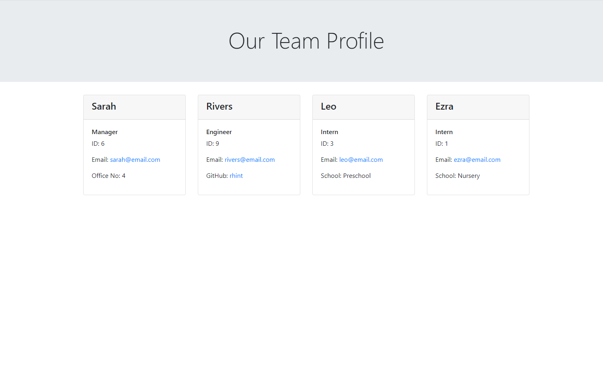
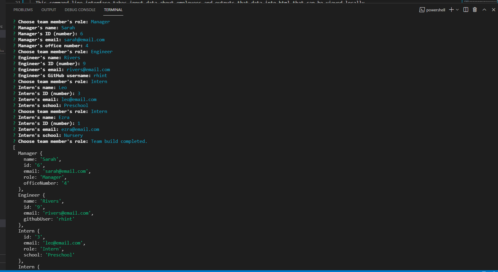

# Team Profile Generator

  

  ## Table of Contents
   
   [ - Description](#description)
 
   [ - Installation](#installation)
 
   [ - Usage](#usage)
   
   [ - Tests](#tests)
   
   [ - Questions](#questions)
  
   [ - License](#license)

 
   ## Description
  This command line interface takes input data about employees and outputs that data into html that can be viewed locally.

  ## Screenshots
  
  

  ## Video Link
  [Video Walkthrough](https://drive.google.com/file/d/1yXZYWASELFwmwOnYed-oUHt5cC46vW4P/view)
  
  
  ## Installation
 `npm i` typed into the terminal will install all required dependencies.
 

  ## Usage
 The purpose of this project is to gather information about your team members so their roles, ID's, emails, and other necessary data can be kept in one place.
 
  
  ## Tests
  To run tests, type `npm run test` in the terminal.
  

  ## Questions
  Feel free to contact me via email, smcfarland2@gmail.com if you have any questions regarding this project. 
  Additionally, my GitHub profile is [SarahHn92](https://github.com/SarahHn92) to view more projects.

  ## License
  The MIT license gives users express permission to reuse code for any purpose, 
  sometimes even if code is part of proprietary software. As long as users include the original 
  copy of the MIT license in their distribution, they can make any changes or modifications to the 
  code to suit their own needs.